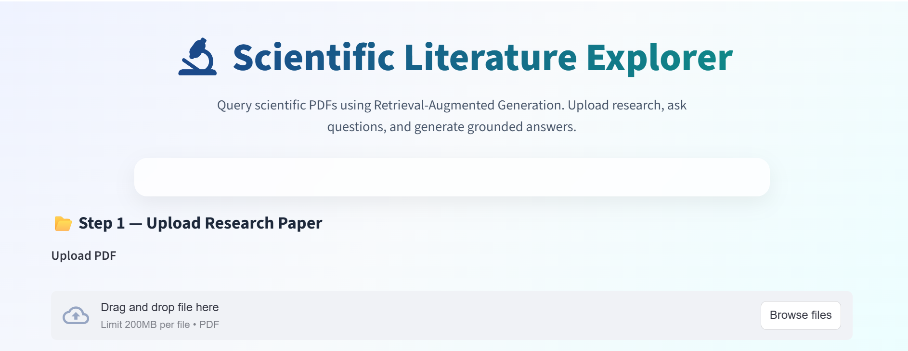
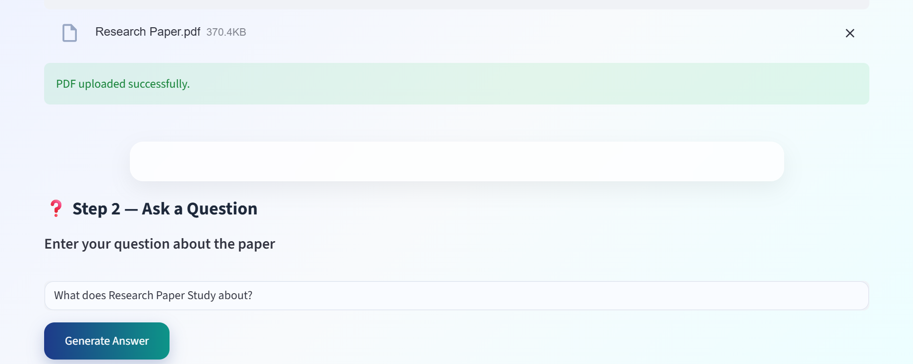
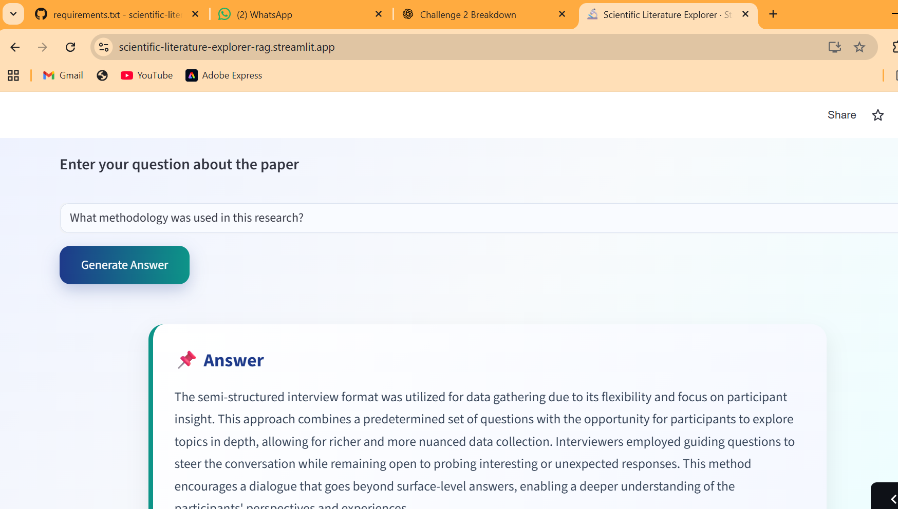

# 📄 Scientific Literature Explorer — Research Paper Q&A using RAG

An end-to-end Retrieval-Augmented Generation (RAG) system that allows users to query research papers in plain English and receive answers grounded directly in the source document.

## 🌐 Live Demo:

Try the deployed application:

https://scientific-literature-explorer-rag.streamlit.app/

Users can upload a research paper PDF and interact with it through the Streamlit interface.

## 🚀 Key Features

- Research paper Q&A using RAG
- Grounded responses from source PDFs
- Semantic retrieval using FAISS
- Prompt compression via ScaleDown
- OpenRouter / OpenAI-compatible LLM integration
- Streamlit web interface
- Modular pipeline architecture

## 🧠 Problem Statement

Academic research papers are often long, dense, and time-consuming to read. Finding specific information requires manually scanning pages or relying on keyword search, which often misses contextual meaning.

Large language models can answer questions quickly but hallucinate without grounding in source material.

This project solves that by combining retrieval + generation to produce context-aware answers.

## ⚙️ Solution Overview

This project implements a Retrieval-Augmented Generation (RAG) pipeline enabling users to interact with research papers through natural language questions.

Workflow summary:

1. Research paper PDF is ingested.

2. Text is extracted and split into chunks.

3. Chunks are converted into embeddings.

4. Embeddings are stored in FAISS.

5. Relevant chunks are retrieved via semantic search.

6. Context is compressed using ScaleDown.

7. LLM generates a grounded answer.

## 🏗️ Project Architecture

The system follows a modular RAG pipeline:

- PDF Loader  
- Embedding Module  
- Vector Store (FAISS)  
- Retriever  
- Context Builder  
- Prompt Compression (ScaleDown)  
- Answer Generator 

## 🖥️ UI Preview





## 🧰 Tech Stack

- Python – Core programming language  
- LangChain – RAG pipeline orchestration  
- FAISS – Vector database for semantic search  
- Sentence Transformers – Embedding generation  
- ScaleDown API – Prompt compression & token optimization  
- OpenRouter / OpenAI-compatible LLMs – Answer generation  
- Streamlit – Web-based user interface

## 📌 Project Status

The system supports question answering over research papers via both:

- Command-line interface
- Streamlit web interface

Users can upload PDFs, ask questions, and receive grounded answers through an interactive UI.

Future improvements may include:

- Multi-document support
- Citation highlighting
- Persistent vector storage
- Advanced chat history

## 🛠️ Setup & Installation

### 1. Clone the repository

```bash
git clone https://github.com/rakshachahar/scientific-literature-explorer-rag.git
cd scientific-literature-explorer-rag
```

### 2. Install dependencies

```bash
pip install -r requirements.txt
```

### 3. Set required API keys

```bash
export SCALEDOWN_API_KEY="your_scaledown_key_here"
export OPENROUTER_API_KEY="your_openrouter_key_here"
```

### 4. Add a research paper

Place a PDF file inside:

```
data/sample_papers/
```

### 5. Run the application

```bash
python src/app.py
streamlit run src/ui.py
```

## Example Usage

**Question**

```
What is the main focus of this research paper?
```

**Generated Answer**

The study examines how advanced language learners use mobile devices to support English language learning, based on interview-based qualitative analysis.

## 📂 Project Structure

```text
src/
├── loaders/        # PDF ingestion & chunking
├── embeddings/     # Embedding generation
├── vectorstore/    # FAISS indexing
├── rag/            # Retrieval + generation pipeline
├── ui.py           # Streamlit interface
└── app.py          # CLI entry point

data/
└── sample_papers/  # Input research papers

docs/
├── architecture.md
└── workflow.md
```

### 🚀 Deployment

The application is deployed on Streamlit.

🌐 Live Demo:  
https://scientific-literature-explorer-rag.streamlit.app/